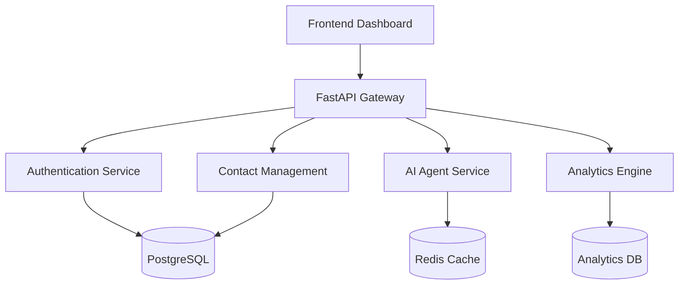

# Opero - AI-Powered Business Automation Platform


## 🎯 Vision
**Streamline. Automate. Excel.**

Opero empowers businesses to achieve unprecedented efficiency through intelligent automation, seamless integrations, and AI-driven insights.

## ✨ Key Features

### 🤖 **Intelligent AI Agent**
- Natural language business automation
- Smart task execution and workflow management
- Context-aware responses and recommendations
- Advanced analytics and reporting

### 👥 **Advanced Contact Management**
- Comprehensive contact profiles with rich metadata
- Smart search and filtering capabilities
- Automated contact insights and relationship mapping
- Integration with communication channels

### 🔐 **Enterprise Security**
- JWT-based authentication system
- Role-based access control (RBAC)
- API rate limiting and security headers
- Audit logging and compliance tracking

### 📊 **Business Intelligence**
- Real-time analytics dashboards
- Automated report generation
- Performance metrics and KPI tracking
- Predictive insights and recommendations

## 🏗️ Architecture



## 🚀 Quick Start

### Prerequisites
- Python 3.12+
- PostgreSQL 14+
- Redis 6+
- Git

### Installation

1. **Clone Repository**
```bash
git clone https://github.com/your-username/opero.git
cd opero
```

2. **Create Virtual Environment**
```bash
python -m venv .venv
# Windows
.venv\Scripts\activate
# macOS/Linux
source .venv/bin/activate
```

3. **Install Dependencies**
```bash
pip install -r requirements.txt
```

4. **Environment Configuration**
```bash
cp .env.example .env
# Edit .env with your configuration
```

5. **Start the Server**
```bash
# Development
python start_server.py

# Production
uvicorn app.main:app --host 0.0.0.0 --port 8000
```

6. **Access the Platform**
- **API Documentation**: http://localhost:8000/docs
- **Dashboard**: Open `dashboard.html` in browser
- **Health Check**: http://localhost:8000/health

## 📖 API Documentation

### Core Endpoints

| Endpoint | Method | Description |
|----------|--------|-------------|
| `/` | GET | Welcome message and system status |
| `/health` | GET | Health check and system metrics |
| `/docs` | GET | Interactive API documentation |

### Authentication
| Endpoint | Method | Description |
|----------|--------|-------------|
| `/auth/login` | POST | User authentication |
| `/auth/me` | GET | Current user information |

### Contact Management
| Endpoint | Method | Description |
|----------|--------|-------------|
| `/contacts/` | GET | List all contacts |
| `/contacts/` | POST | Create new contact |
| `/contacts/{id}` | GET | Get specific contact |
| `/contacts/{id}` | PUT | Update contact |
| `/contacts/{id}` | DELETE | Delete contact |
| `/contacts/search/` | GET | Search contacts |
| `/contacts/stats/overview` | GET | Contact statistics |

### AI Agent
| Endpoint | Method | Description |
|----------|--------|-------------|
| `/agent/chat` | POST | Chat with AI agent |
| `/agent/task` | POST | Execute business task |
| `/agent/capabilities` | GET | Agent capabilities |
| `/agent/analytics` | GET | Usage analytics |

## 🛠️ Development

### Project Structure
```
opero/
├── app/
│   ├── main.py              # FastAPI application
│   ├── core/                # Core utilities
│   │   ├── database.py      # Database configuration
│   │   ├── security.py      # Authentication & JWT
│   │   └── config.py        # Application settings
│   ├── models/              # Database models
│   │   ├── user.py          # User model
│   │   └── contact.py       # Contact model
│   ├── routes/              # API endpoints
│   │   ├── auth.py          # Authentication routes
│   │   ├── contacts.py      # Contact management
│   │   └── agent.py         # AI agent endpoints
│   └── services/            # Business logic
│       └── ai_agent.py      # AI agent service
├── dashboard.html           # Interactive dashboard
├── start_server.py          # Development server
├── requirements.txt         # Python dependencies
├── .env                     # Environment configuration
└── README.md               # This file
```

### Running Tests
```bash
# Install test dependencies
pip install pytest pytest-asyncio httpx

# Run tests
pytest tests/

# Run with coverage
pytest --cov=app tests/
```

### Code Quality
```bash
# Format code
black app/
isort app/

# Lint code
flake8 app/
mypy app/
```

## 🚀 Deployment

### Docker Deployment
```bash
# Build image
docker build -t opero:latest .

# Run container
docker run -p 8000:8000 opero:latest
```

### Production Considerations
- Use PostgreSQL for database
- Set up Redis for caching
- Configure environment variables
- Enable HTTPS with SSL certificates
- Set up monitoring and logging
- Implement backup strategies

## 🤝 Contributing

1. Fork the repository
2. Create a feature branch (`git checkout -b feature/amazing-feature`)
3. Commit your changes (`git commit -m 'Add amazing feature'`)
4. Push to the branch (`git push origin feature/amazing-feature`)
5. Open a Pull Request

## 📄 License

This project is licensed under the MIT License - see the [LICENSE](LICENSE) file for details.

## 🎉 Acknowledgments

- Built with [FastAPI](https://fastapi.tiangolo.com/)
- Powered by modern Python ecosystem
- Inspired by the need for intelligent business automation

---

**Made with ❤️ for businesses ready to embrace the future of automation**

For questions and support, please open an issue or contact the development team.
